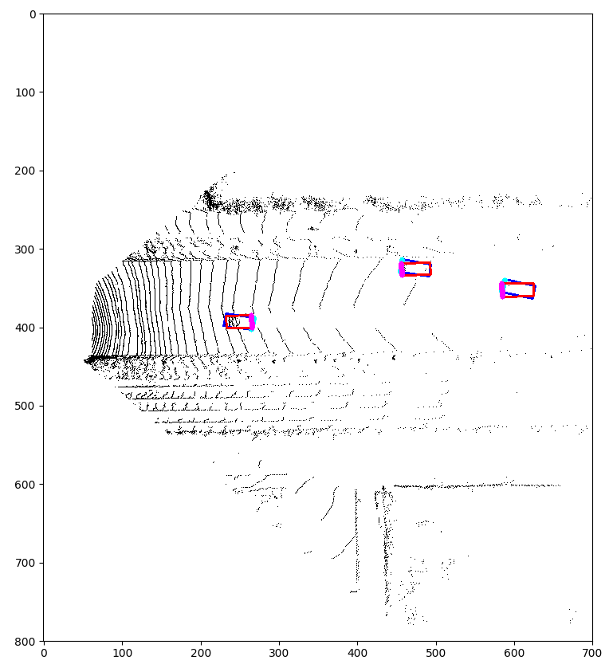
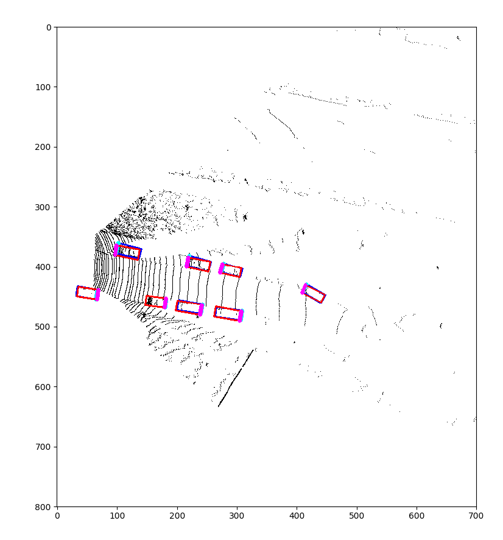

# Introduction

This is an unofficial inplementation of [Bird's Eye View Object Detection Algorithm for self-driving Cars] [PIXOR](http://openaccess.thecvf.com/content_cvpr_2018/CameraReady/3012.pdf) in Pytorch. A large part of this project is based on the work [here](https://github.com/ankita-kalra/PIXOR). Thanks to [@Ankita Kalra](https://github.com/ankita-kalra). This work is still ongoing.
#requirement
You should have the pointcloud with shape (n, 7) in the bin file.
点云应该是有颜色(x,y,z,r,g,b,i)的点云.你也可以处理(x,y,z,i)格式的点云.需要稍作调整.
这个比我前一个pixor版本的要好些.更稳定一些.

# Dependencies
- `python3.5+`
- `Pytorch` (tested on 0.4.1)
- `opencv-python`
- `shapely`
- `matplotlib`
- `tensorboardX`

# Installation
1. Clone this repository.


# Data Preparation
1. Download the 3D KITTI detection dataset from [here](http://www.cvlibs.net/datasets/kitti/eval_object.php?obj_benchmark=3d). Data to download include:
    * Velodyne point clouds (29 GB): input data to VoxelNet
    * Training labels of object data set (5 MB): input label to VoxelNet
    * Camera calibration matrices of object data set (16 MB): for visualization of predictions
    * Left color images of object data set (12 GB): for visualization of predictions

2. Split the training set into training and validation set according to the protocol [here](https://xiaozhichen.github.io/files/mv3d/imagesets.tar.gz). And rearrange the folders to have the following structure:
```plain
└── KITTI
       ├── training   <-- training data
       |   ├── image_2
       |   ├── label_2
       |   └── velodyne
       └── validation  <--- evaluation data
       |   ├── image_2
       |   ├── label_2
       |   └── velodyne
       |
       |__ train.txt
       |
       |__ val.txt
       |
       |__ trainval.txt
```

# Train

```bash
$ python run_training.py
```
1. There is a pre-trained model for car in `pretrained_models/model_90.pth`.


# inference
```bash
$ python run_inference.py
```

# results
## prediction for rgb pointcloud(add se_module) input shape (800, 700. 36+3)  output shape (800, 700, 7)



# TODO
- [X] improve the performances
- [X] provide SummaryWriter()
- [ ] provide run_evaluate.py
